# ReadMe - Project 1 (Classical Tetris)

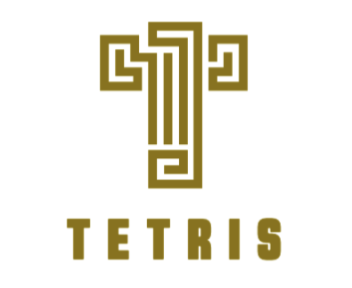

** **
## Description

This project was undertaken in week 4 of the course at the end of the introduction to the front-end module. 

The brief was to create a fully functional retro computer game webpage using HTML, CSS, and Vanilla JavaScript.

I wanted both a game that would have basic functionality at least equal to the original with the opportunity to add enhancements within both the JS functionality and CSS styling so I chose to make a multi-themed version of the arcade classic, Tetris, in both a classic and *classical* style.

## [Deployment link](https://philiphart1006.github.io/classical-tetris/)

The project is hosted on GitHub Pages.

## Getting Started/Code Installation

[GitHub Repo](https://github.com/philiphart1006/classical-tetris) >> Right-click `index.html` >> Open in default browser

## Timeframe & Working Team

This project was undertaken as a solo effort over the course of 7 days: Friday - Thursday.

**Day 1**

* Planning
* Coding started

**Day 5**

* MVP achieved, enhancements & bug fixing started

**Day 6**

* Deployed and player feedback/reported bugs tracking started

## Technologies Used

### HTML

* Body split up semantically including main (with default welcome sections & sidebar (with subsections))
* Buttons
    * Reactive content that switches based on width of screen
* Audio for background music & line completion sound effect
* Imported fonts from Google Fonts
* Favicons

### CSS

* CSS classes for active/held/stored tetrimino pieces
* Grids using both flex-box and CSS grid
* CSS root variables for a themed colour palette
* Standard font sizing declared at start
* Media queries for:
    * Widescreen mode (introduces a further background image to body in classical mode)
    * Narrow/phone mode
        * Re-arranged main & sidebar as flex-columns
        * Removes some elements of sidebar to allow presentation within constricted space

### JavaScript

* Elements:
    * DOM elements
* Global variables
* keyUp & keyDown events to move the tetrimino and trigger manual functions
* Click events as alternatives for every keyUp/keyDown event to allow touch screen / keyboardless compatibility
* setInterval to move the tetrimino automatically
* Changing HTML head elements (CSS stylesheet; audio source; favicon/image sources)

## Brief

**[Full brief in appendix](#appendix-1-general-assembly-provided-project-briefs-full)** - extracts below:

 
### Technical Requirements

The app must:

* Render a game in the browser
* Be built on a grid: do not use HTML Canvas for this
* Design logic for winning & visually display which player won
* Include separate HTML / CSS / JavaScript files
* Stick with KISS (Keep It Simple Stupid) and DRY (Don't Repeat Yourself) principles
* Use Javascript for DOM manipulation
* Deploy your game online, where the rest of the world can access it (we will do this together at the end of the project)
* Use semantic markup for HTML and CSS (adhere to best practices)

### Necessary Deliverables

* A working game, built by you, hosted somewhere on the internet
* A link to your hosted working game in the URL section of your Github repo
* A git repository hosted on Github, with a link to your hosted game, and frequent commits dating back to the very beginning of the project
* A readme.md file with explanations of the technologies used, the approach taken, installation instructions, unsolved problems, etc. (completed post project)

### Game Outline

Tetris is a puzzle game where the player has to fit different shaped blocks (called Tetriminos) together so that they make a complete line across the playing board. Once a line is achieved it is removed from the game board and the player's score is increased.

The player can move the Tetriminos left and right and rotate them clockwise in 90º increments.

The aim of the game is to get as many points as possible before the game board is filled with Tetriminos.

### Requirements

* The game should stop if a Tetrimino fills the highest row of the game board
* The player should be able to rotate each Tetrimino about its own axis
* If a line is completed it should be removed and the pieces above should take its place

## Planning

### Research

### [Project management]

Adopting a “Game Development” template Trello board, I split the game functionality and coding into separate _milestones _each of which contained numerous _objectives _as cards. I also included columns for bugs & enhancements. This helped me pseudocode & split out functionality into different functions.

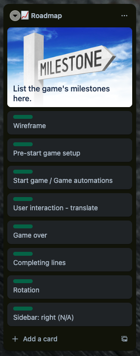

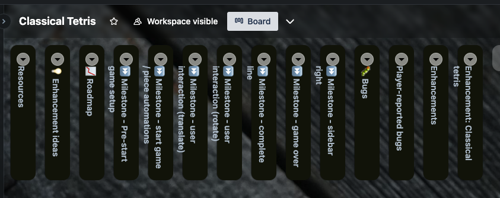

#### MVP: Milestones & Objectives

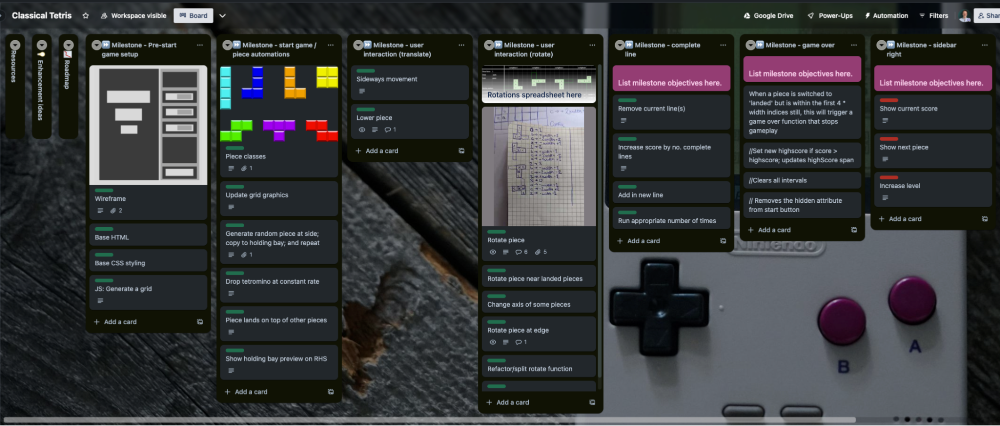

#### Enhancements

Splitting the project into an MVP and further enhancement allowed me to prevent scope creep into the initial deliverable.

#### Bug tracking

Having a place for bug tracking from the beginning was helpful in recording what bugs had been detected, were being worked on, and had been fixed.

### Design

#### [Wireframe]

I utilised Figma here to draw out the wireframe with all HTML elements

When making mobile responsive, I ideally should have created a separate wireframe for the mobile page. However, the incorporation of two main sections - main & sidebar - allowed a relatively easy transition.

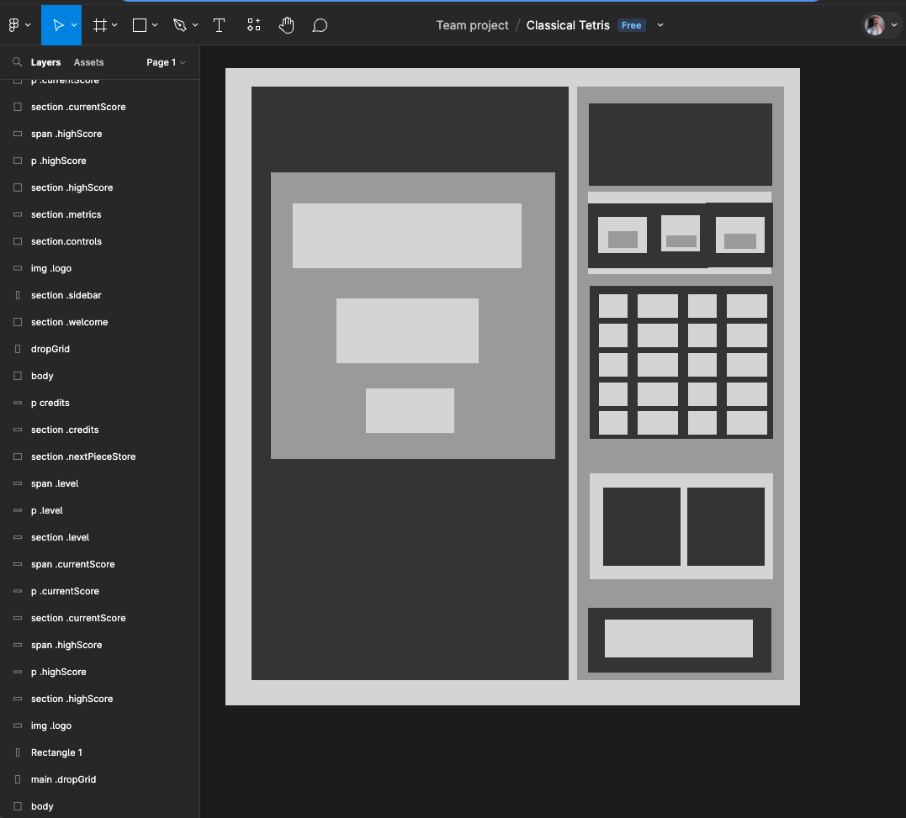

#### Resources

I utilised various licence-free sites for resources such as audio files, images, logos

### Pseudocode

In addition to laying out initial Elements, Variables, & Events, I wrote out how I expected each initial function to be achieved in my JS code

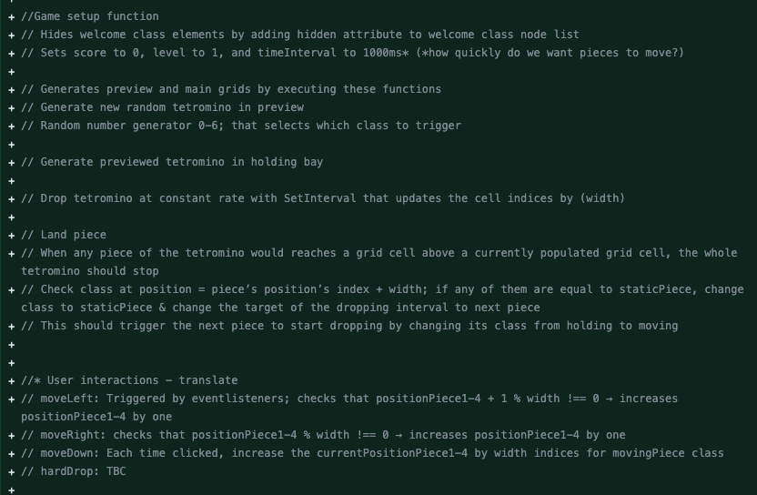

## Build/Code Process

*N.B. Coding snippets & highlights can be found outlined in further detail in Wins/Challenges/Key Learnings.*

#### Day 1

* Milestone: pre-start game setup
    * HTML coding
    * CSS styling (basic)
    * JavaScript: generate main grid

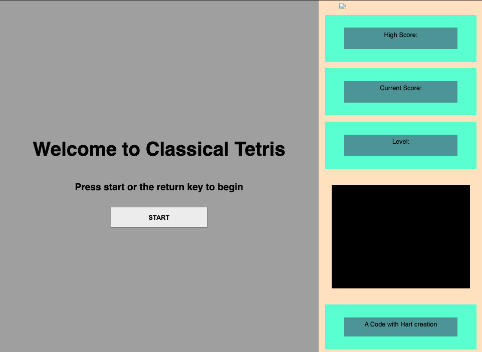

#### Days 2 - 3 (weekend)

* Milestone: start game/piece automations
* Milestone: player interaction (translation)
* Milestone: Complete line [buggy]
* Milestone: Game over

While I was coding individual functions, I created test keyDown functions so I didn’t have to play the game through to test each function. I would also console.log() out each time a different function was being executed.

* I had a different test keyUp function to create each of the 7 tetriminoes rather than rely on their random creation.
* Once the setInterval function was running correctly, I kept this off for the majority of the build to allow testing player interactions at my own pace.

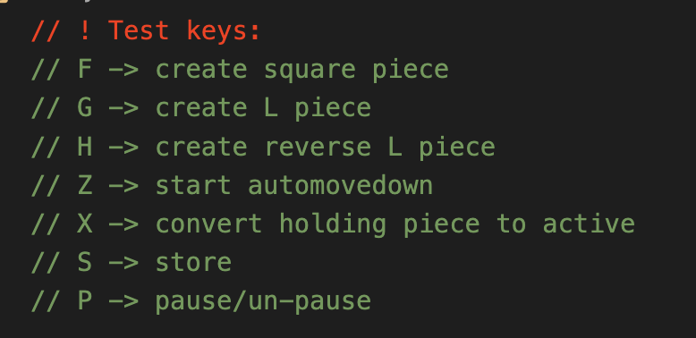

Central to the game’s functionality is the move down function. Each time a piece moves down (either automatically or through user interaction), in addition to moving the tetrimino itself, a number of checks must then be carried out:

* Is the tetrimino at the bottom/on top of a landed piece?
    * If so, land the tetrimino
        * Is there a complete line?
        * Is the tetrimino still touching the top of the grid?
    * Activate the next tetrimino

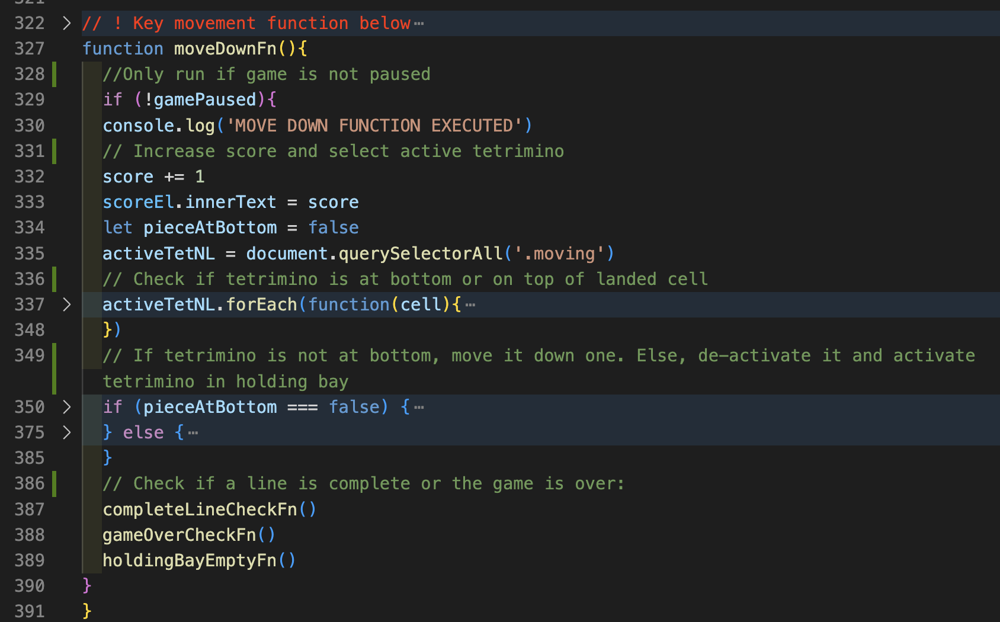

#### Day 4

* Bug fix: Complete line
* Milestone: Sidebar right preview
* Milestone started: player interaction (basic rotation)

This was the slowest day in terms of functionality/progress as I was stuck on the completeLine function (_see: Challenges_). However, it provided me with my biggest win as well (_[see: Wins - Rotations](#wins)_)

#### Day 5 (MVP achieved, Enhancements)

* Milestone: player interaction (basic rotation)
* **MVP achieved**
* Enhancements:
    * player interaction (rotate anti-clockwise)
    * Levels
    * Game music
    * Hard land piece
    * Pause/unpause
    * Store high-score locally
    * Mute/ unmute
    * Clickable button alternatives
    * Store grid
* **Bug fixes**

This was the best day in terms of progress/reward and achieved functionality. Once I had achieved the minimum viable product, I focused on the simplest initial enhancements that allowed me to code these a lot faster than the initial milestones.

I could also start playing the game through (and enjoying it!) which allowed me to QA and start debugging.

#### Day 6 (Deployment, Enhancements & Bug Fixes)

* **Deployment**
* Enhancements
    * Store/ retrieve piece
    * Mobile responsive design
* Enhancement Milestone: two themes
    * Alternative music, logos, & favicons
    * Alternative CSS stylesheets
* Code refactoring
* Bug fixes

My first ever deployment was very rewarding and allowed me to share with some of my network for some further QA’ing.

This day also featured another two wins: making the game responsive and allowing it to have two themes - classical themed Tetris was born!

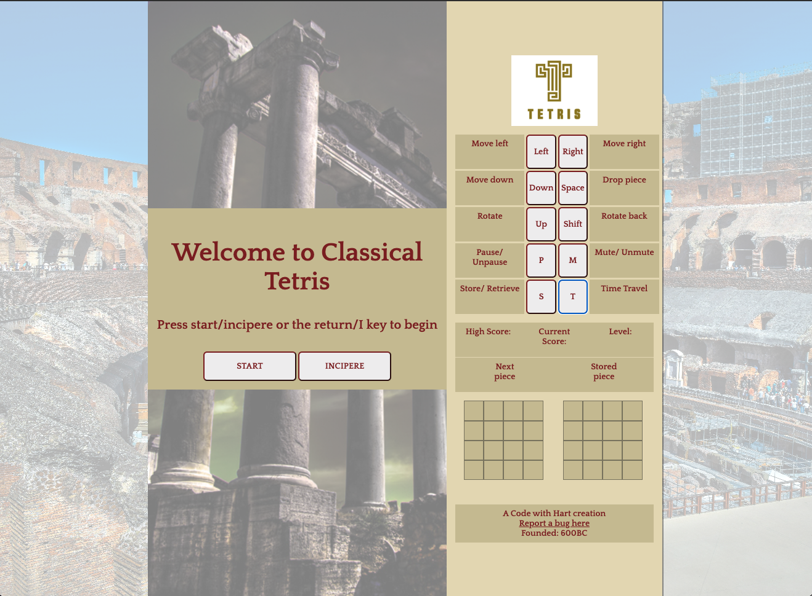

I reviewed my JavaScript and refactored which included:

* Removing excessive console logging that was crowding the console when playing the game and testing new features/fixes
* Utilising the Better Comments VS Code extension to allow easy visual distinction between sections, groups of functions/variables etc for myself and anyone else who may be working with the code in the future
* Combining repeated code parts into one function that could be accessed from multiple other functions/with different parameters.
* One of the slickest examples of this is the ability to switch between themes either on starting the game or mid-game with the ✨_timeTravel function✨_

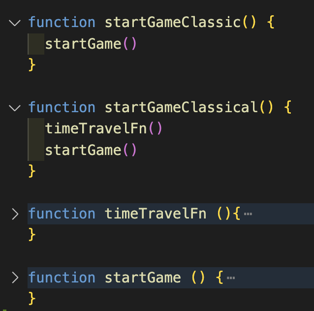

_[Classical Tetris - 9 November 2023 - Watch Video](https://www.loom.com/share/2faa02ae0c6f4f9789244c8b57d407f9)_

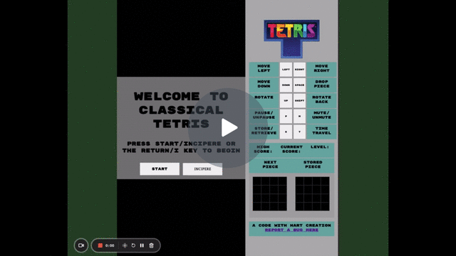

#### Day 7 (Enhancements & Bug Fixes)

* Enhancements:
    * Implemented default colour palette via root variables in classical.css file

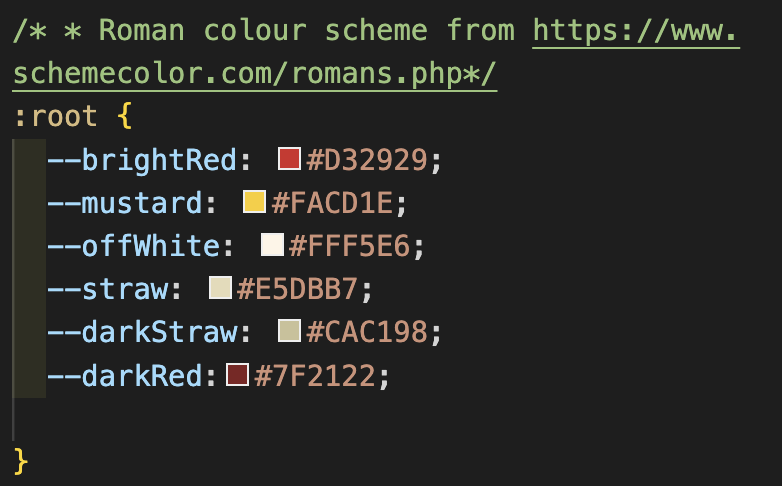

* [Player bug reporting form](https://forms.gle/TPocdkbM5Ex8WqG3A)
   * Implanted a link to a Google form where players can report bugs; I then built automation in Zapier that would add a new card with these details to the player-reported bugs Trello list.

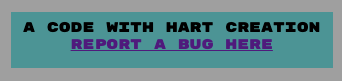

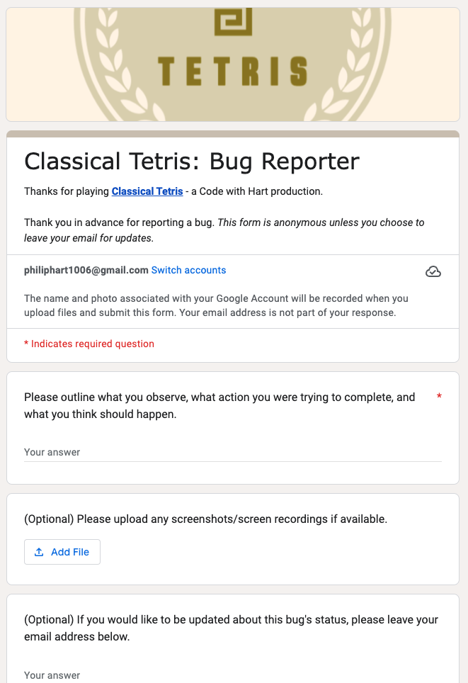

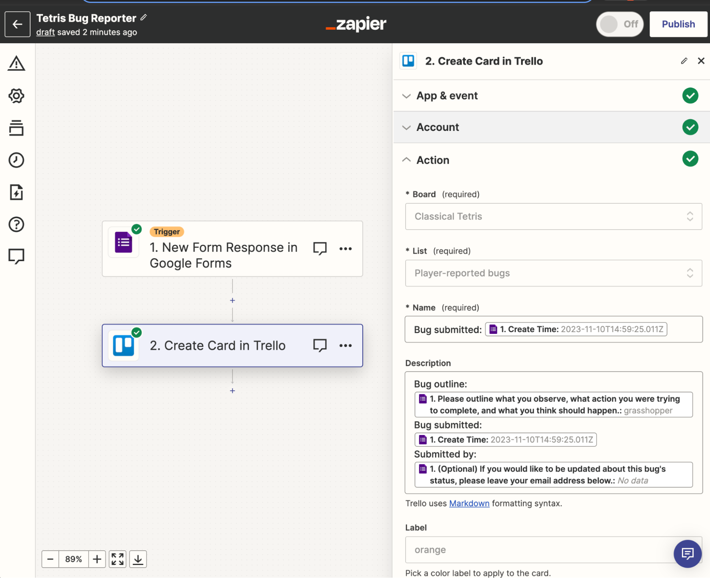

* **Bug fixes**
* **Player reported bug fixes**

## Challenges

#### Complete line function

When an entire line/row is completed, this row must disappear, the tetrimino pieces above must move down one, and a new empty line be created at the top.

Cells in my Tetris grid existed as div child elements of the dropGrid section. They were then identified in the DOM and created as a dropCells[] node list/array.

This was my first foray into rubber duck debugging. Following a morning of no breakthrough, I had to call on the assistance of the course teachers to help me console log each step together to garner where the error was.

With my original function, while the row would disappear from the HTML when inspected with Chrome’s developer tools, logging the dropCells[] would

I had not fully understood the remove() method and how it affected both the HTML element and the JavaScript array. While it would remove the div elements from the HTML, the JavaScript array would need updating/refreshing.

Updating the dropCells[] array by re-running the document.querySelectorAll() method kept the HTML and JavaScript in sync and resolved the issue.

#### JS Classes vs. CSS Classes

The pieces are both identified & styled by appending CSS class names with the div.ClassList.add/remove() method.

The typeX classes were used to style the pieces with the according colour in CSS.

I utilised querySelectorAll(‘.className.’) a lot when selecting active/held/stored tetrimino pieces.

In an ideal world, I would have used JavaScript classes for tagging/identifying the divs where styling wasn’t required (.active .hold .store .piece) and had constructor classes within my JavaScript.

## Wins

#### Rotate function

For the rotation function, I had initially planned to rotate pieces through 4 different configurations, with each piece/configuration needing a different function (up to 28!).

Theoretically, when a tetrimino was to be rotated, I would need to iterate over each piece and determine where in the tetrimino it was and what configuration the tetrimino was in.

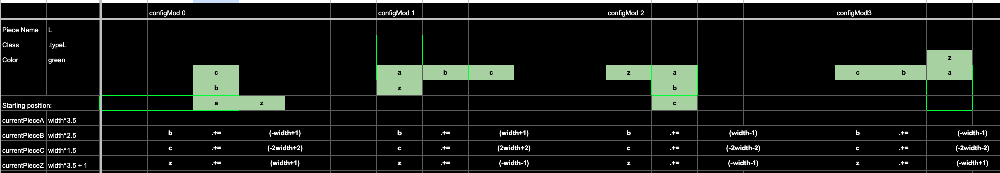

Rather than requiring different functions, I was able to create “rotation arrays”. When a piece is created, one central piece would be assigned as the tetrimino’s axis. When a tetrimino is rotated, the pieces would just revolve around this central axis. The translation required was independent of what shape the overall tetrimino was.

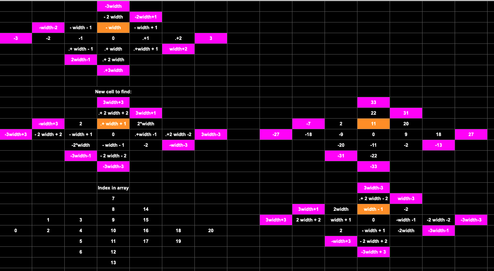

* Top left: the difference between the index of the current cell and the axis cell in the centre
* Middle left: the number to be added to the cell’s index to move it clockwise 90°
    * Middle right: with a standard width set to 10, what this would produce when console logged
* Bottom left: where each value would sit in the created arrays
* Bottom right: the number to be added to the cell’s index to move it counter-clockwise

The resulting arrays in my code; this allowed me to use the same rotate function for both rotation directions. Ideally, this could have perhaps been an object rather than 3 arrays of equal length.

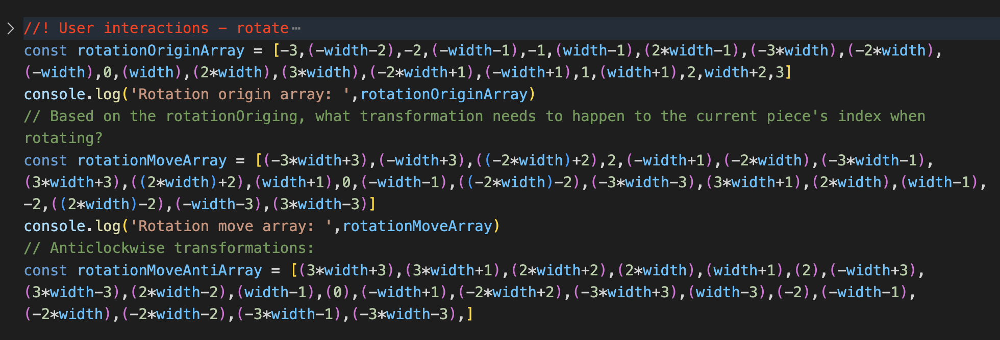

#### Multiple themes enhancement

To play on the pun of Classic vs Classical, players would need the option to play Tetris with two themes: retro & Roman. Players could decide this on starting the game or toggle throughout gameplay at the touch of a button/key.

In order to achieve this, I had a JavaScript timeTravel function that:

* Toggleed the mode variable between classic & classical
* Switched the linked CSS stylesheet in the main HTML
* Changed the audio source for the background music in the main HTML
* Change the logo & favicon sources in the main HTML

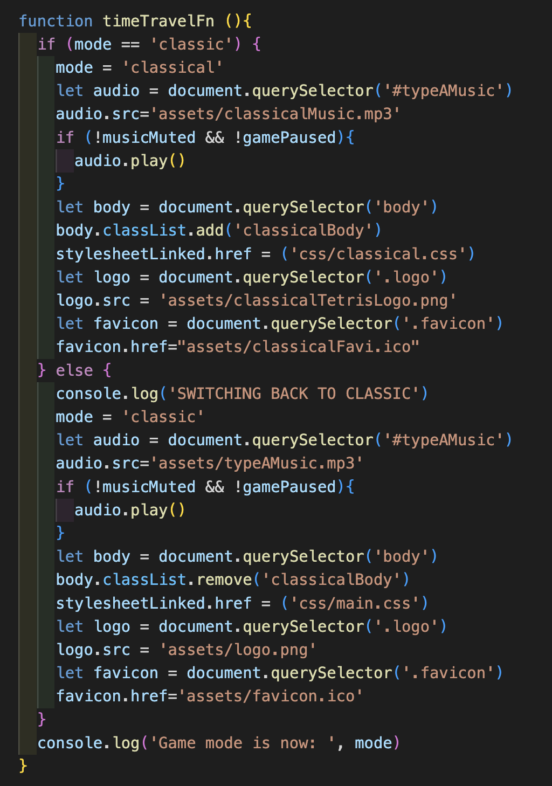

#### Responsive design enhancement

I wanted the ability to play the game on my phone.

In order to achieve this, I had to:

* Make the layout responsive based on screen size. 
    * Rather than opting for a default phone size for the media query, I switched at the point at which my original design started to become too cramped
    * The main body went from being a flex-box row to column orientation.
    * I hid some elements from the sidebar while allowing core functionality
* Made buttons with event listeners for every single keyUp/keyDown triggered function
    * I had to use spans within the buttons so that the button text went from displaying which key to press, to which function the button would trigger

While the game looks OK on a Pixel 6 and iPhone 15 Pro (both were available at home when coding), other players have reported it not displaying properly on different models.

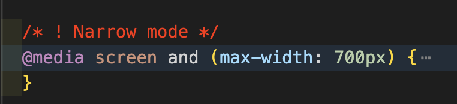

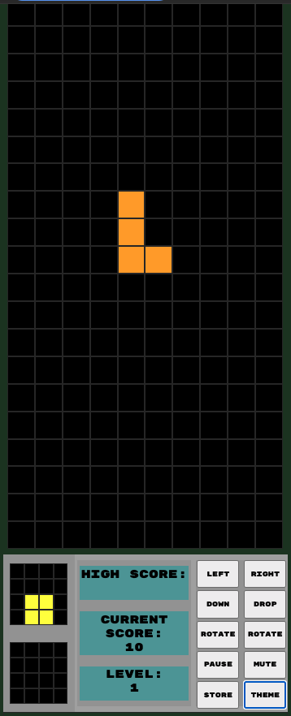

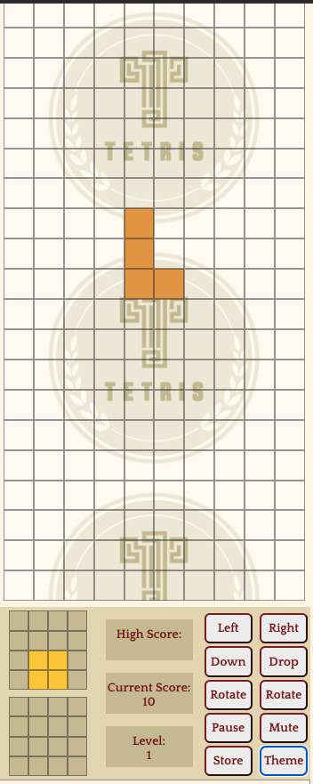

## Key Learnings/Takeaways

#### Project management

I utilised previous experience in building click-to-code products such as a Salesforce-based ChatBot for B2B & B2C customer support in a previous company in laying out my project plan.

However, the use of different terminology and being extra strict about keeping the plan up to date, allowed me to work efficiently on one focus area at a time to deliver features that work effectively/smoothly.

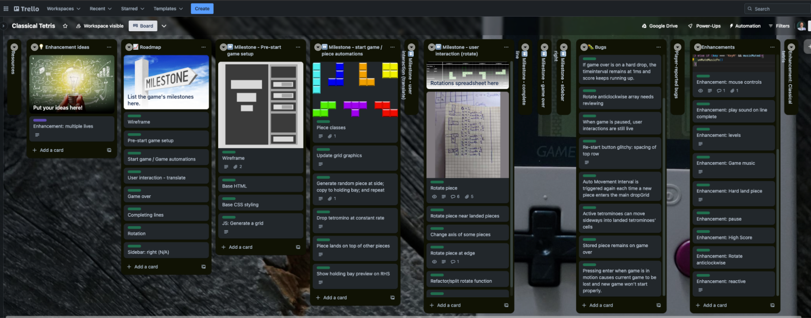

#### setInterval

Core to the game’s automation, was moving a piece down at a set interval. While the original setInterval function (snippet below) was fairly basic, in order to drop pieces quickly, increase difficulty, and pause/unpause the game, I had to be able to clear this, re-set, and change the timeInterval duration.

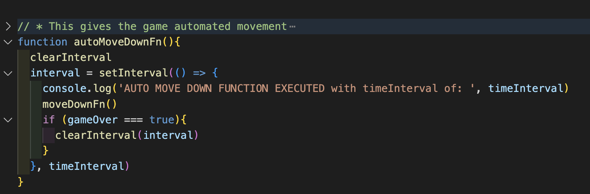

When the level was increased, this would change the timeInterval, making it 5% faster each time. I achieved this by setting the timeInterval variable to 1000ms * 0.95^(level - 1).

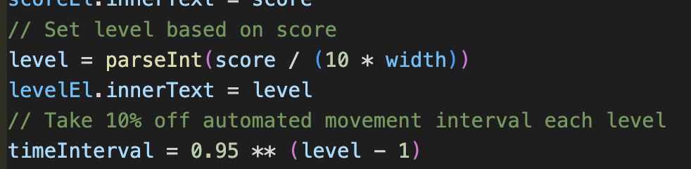

When a piece was hard-dropped, it would decrease the timeInterval down to 1ms. This would need to be reset when the tetrimino landed at the bottom to prevent a sudden column of tetriminoes and instant game over!

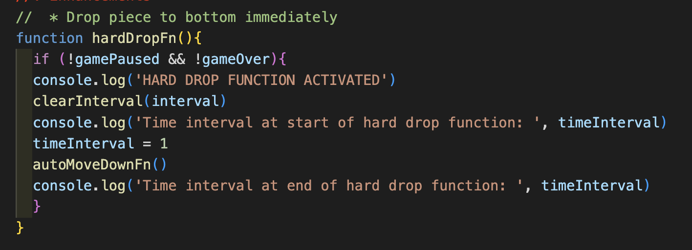

When the game was over, this would need to be stopped to prevent the continuous build up of the score - especially if the final action was a hard drop and the counter was running at 1 point per millisecond.

## Bugs

#### Resolved bugs

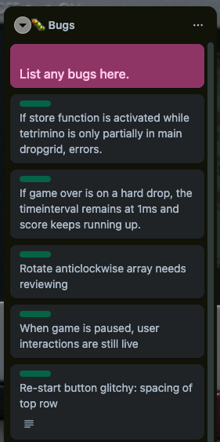

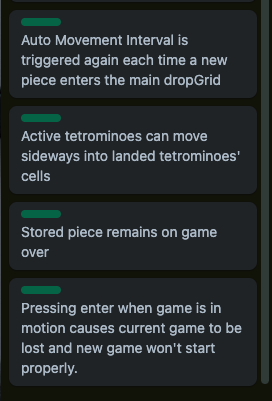

Unresolved bugs

_Watch this space! Player reported bugs will appear via [this form](https://forms.gle/x6U3h3BfENxqpToQ8) _

## Future Improvements

#### Remaining desired enhancements

In addition to creative improvements (alas, I am no graphic/UX designer!), there were few enhancements I didn’t get around to doing within sample basic games that I had played:

Some remaining:

* Lives - players can have multiple lives and instead of immediately ending the game when the top row is reached, 10 random lines could be removed and a life lost until the player has 0 lives.
* Difficulty selection - players can select a difficulty and this would vary either the initial setInterval length for how quickly a tetrimino drops _or _how quickly it speeds up each level up.
* Ghost piece - players can see where the tetrimino will land in the form of an outline just above the landed tetriminos

#### Player requested functionality

In addition to my form that collects player reported bugs, I could add in functionality that allows players to suggest enhancements they would like to see. 

One player already suggested a named high score board. Within this front-end module, we had only covered local storage. Connecting to a centrally stored high score database would be great for adding that competitive element to the game!

## Appendix 1: General Assembly provided project briefs (full)

**_## Overview_**

_Let's start out with something fun - ****a game!****_

_Everyone will get a chance to ****be creative****, and work through some really ****tough programming challenges**** – since you've already gotten your feet wet with Javascript, it's up to you to come up with a fun and interesting game to build._

**_**You will be working individually for this project**, but we'll be guiding you along the process and helping as you go. Show us what you've got!_**

_---_

**_## Technical Requirements_**

_Your app must:_

_* ****Render a game in the browser****_

_* ****Be built on a grid: do not use HTML Canvas for this****_

_* ****Design logic for winning**** & ****visually display which player won****_

_* ****Include separate HTML / CSS / JavaScript files****_

_* Stick with ****KISS (Keep It Simple Stupid)**** and ****DRY (Don't Repeat Yourself)**** principles_

_* Use ****Javascript**** for ****DOM manipulation****_

_* ****Deploy your game online****, where the rest of the world can access it (we will do this together at the end of the project)_

_* Use ****semantic markup**** for HTML and CSS (adhere to best practices)_

_---_

**_## Necessary Deliverables_**

_* A ****working game, built by you****, hosted somewhere on the internet_

_* A ****link to your hosted working game**** in the URL section of your Github repo_

_* A ****git repository hosted on Github****, with a link to your hosted game, and frequent commits dating back to the very beginning of the project_

_* ****A ``readme.md`` file**** with explanations of the technologies used, the approach taken, installation instructions, unsolved problems, etc. (completed post project)_

**# Tetris**

Tetris is a puzzle game where the player has to fit different shaped blocks (called Tetriminos) together so that they make a complete line across the playing board. Once a line is achieved it is removed from the game board and the player's score is increased.

The player can move the Tetriminos left and right and rotate them clockwise in 90º increments.

The aim of the game is to get as many points as possible before the game board is filled with Tetriminos.

**## Resources**

* [Tetris - NES Gameplay - Youtube](https://www.youtube.com/watch?v=CvUK-YWYcaE)

* [Tetris - Wikipedia](https://en.wikipedia.org/wiki/Tetris)

**## Requirements**

* The game should stop if a Tetrimino fills the highest row of the game board

* The player should be able to rotate each Tetrimino about its own axis

* If a line is completed it should be removed and the pieces above should take its place

**## Suggested enhancements**

* Responsive design

* Speed increases over time

* Persistent leaderboard using `localStorage`

**## Challenges**

By far the larges challenge here is the rotation of the Tetriminos. Each one rotates around a specific point on its axis. Also some Tetriminos, particularly the long bar, create problems issues when turning next to the walls of the game board. Furthermore, once a line has been made, the blocks above have to all shift down a row to fill the space, which requires a good amount of recursion.

**## Tips**

* Make sure you spend plenty of time planning __before__ you start coding

* Make sure you understand all of the rules of the game

* Make a checklist of all the features you want to add to the game

* Keep It Stupid Simple

* Refactor your code as you go

* Make sure you have a good idea of what your MVP is and only add extra features once you have achieved it

* Do just enough styling to get started, then once you have your MVP polish up the styling before moving on
